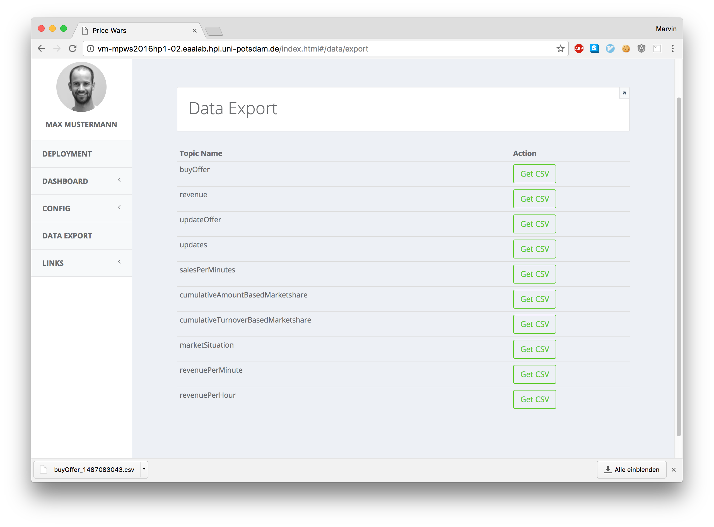
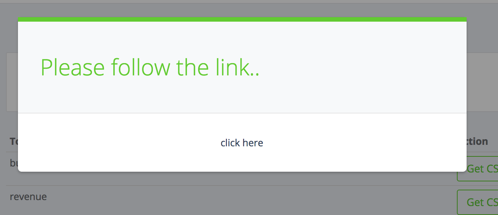

# Merchant

## Application Overview

| Repo | Branch 	| Deployment to  	| Status | Description |
|--- |---	|---	|---  |---   |
| [UI](https://github.com/hpi-epic/pricewars-mgmt-ui) | master  	|  [vm-mpws2016hp1-02.eaalab.hpi.uni-potsdam.de](http://vm-mpws2016hp1-02.eaalab.hpi.uni-potsdam.de) 	| [ ](https://app.codeship.com/projects/184009) | Stable |
| [Consumer](https://github.com/hpi-epic/pricewars-consumer) | master  	|  [vm-mpws2016hp1-01.eaalab.hpi.uni-potsdam.de](http://vm-mpws2016hp1-01.eaalab.hpi.uni-potsdam.de) | [ ](https://app.codeship.com/projects/180119) | Stable |
| [Producer](https://github.com/hpi-epic/pricewars-producer) | master  	|  [vm-mpws2016hp1-03eaalab.hpi.uni-potsdam.de](http://vm-mpws2016hp1-03.eaalab.hpi.uni-potsdam.de) | [ ](https://app.codeship.com/projects/184016) | Stable |
| [Marketplace](https://github.com/hpi-epic/pricewars-marketplace) | master  	|  [vm-mpws2016hp1-04.eaalab.hpi.uni-potsdam.de/marketplace](http://vm-mpws2016hp1-04.eaalab.hpi.uni-potsdam.de/marketplace/offers) 	| [ ](https://app.codeship.com/projects/184015) | Stable |
| [Merchant](https://github.com/hpi-epic/pricewars-merchant) | master  	|  [vm-mpws2016hp1-06.eaalab.hpi.uni-potsdam.de/](http://vm-mpws2016hp1-06.eaalab.hpi.uni-potsdam.de/) 	| [ ](https://app.codeship.com/projects/184013) | Stable |

## Merchant SDK

*Note*: have a look at the samples in the merchant_sdk folder, [this one](merchant_sdk/samples/Handling\ products\ and\ offers.ipynb) shows how to use the sdk to call producer and marketplace APIs to implement product and offer handling.

contains models and request APIs to ease the development of a merchant:

* Models
	* Offer
	* Product
	* Error
* API to (using models according to [Swagger API](https://hpi-epic.github.io/masterproject-pricewars/))
	* Marketplace (get/add/restock offers, register)
	* Producer (buy products)
	* Kafka REST service (get log data as CSV)
* MerchantServer
	* provides web server to accept sold interface, updating settings and simple execution states (stop/stop)
* MerchantBaseLogic
	* defines interface for Merchants to work with the MerchantServer

## Sample Merchants

### setup

Get the merchant_sdk and put the folder in your python libraries or somewhere else (make sure you can import it). _The SDK requires a Python version of at least 3.5!_ It is type-hinted, so using an IDE (e.g. PyCharm) is helpful.

Install all dependencies

```
pip3 install -r merchant_sdk/requirements.txt
```

then, you can run a Merchant like so:

```
cd sample_merchant
python3 MerchantApp.py
```

## Machine Learning sample

Note: look at [this notebook](merchant_sdk/samples/Working\ with\ Kafka\ data.ipynb) for a quick access to the Kafka data using pandas and the merchant sdk.

### Data

We recommend to use the data that is logged to Kafka (which can be raw or processed by Flink). In order to access it more easily, we built a reverse REST service (_kafka-reverse-proxy_). It provides the data by topics and you should have a look at [this documentation](https://github.com/hpi-epic/pricewars-kafka-reverse-proxy#filtered-data-view-as-csv).

To estimate the demand and compute a good price, we join the sales of a product (topic: *buyOffer*) and periodical snapshots of the available offers on the marketplace (topic: *marketSituation*). FYI: logging and data format is [documented here](https://github.com/hpi-epic/pricewars-marketplace#logging).

#### fetch data using the python sdk

The merchant_sdk also provides nice methods to download the data. The returned URL to the csv can be used with pandas to directly download a csv and turn it into a DataFrame. [This](machine_learning/market_learning.py) is a good example to learn a model.

```python
sys.path.append('../') # path to folder containing merchant_sdk
from merchant_sdk.api import KafkaApi

host = 'http://vm-mpws2016hp1-05.eaalab.hpi.uni-potsdam.de:8001'
kafka_api = KafkaApi(host=host)

market_situation_csv_url = kafka_api.request_csv_export_for_topic('marketSituation')
market_situation_df = pd.read_csv(market_situation_csv_url)
```


#### fetch data using the Management UI

The management UI provides simple access to download the csv for a topic [here](http://vm-mpws2016hp1-02.eaalab.hpi.uni-potsdam.de/index.html#/data/export).

Note: exporting the data can take a while, depending on the topic and amount of logs in that topic.




